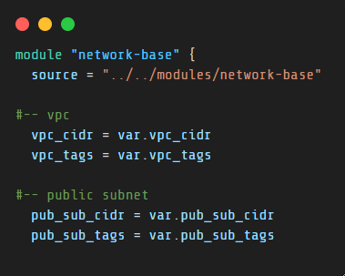

# Terraspace Project WebServer
`network-stack: README`

`./app/stacks/network-stack/README.md`

## Learning Path
- To utilize the `Child Module Variable` in the ***stack***, assign it the value of the corresponding ***Variable*** at the same directory level. The ***Variable*** closely resembles the `Child Module Variable`. Since the `.tfvars` file is located in the ***stack***, Terraspace automatically uses this file for the variables.
`./app/stacks/network-stack/main.tf`


-----

## Issues

raised issue in regards to `.tfvars` and how to use Terraspace Best Practices with this file [here](https://github.com/miGenjutsu/terraspace-webserver/issues/12) 


----

## `./outputs`
- vpc_id_output
<br></br>
----
## Directory
```
network-stack/
├── README.md
├── main.tf
├── outputs.tf
├── tfvars
│   ├── base.tfvars
│   └── dev.tfvars
└── variables.tf
```